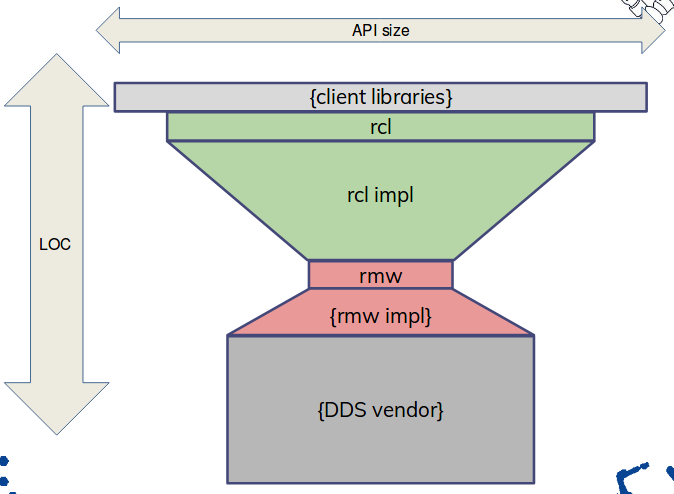
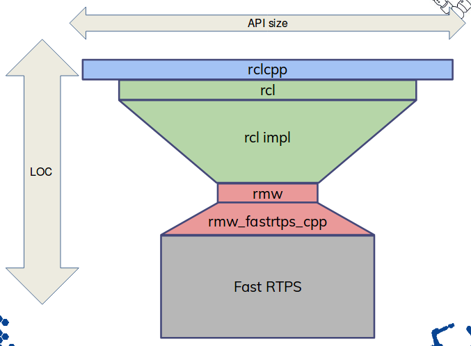
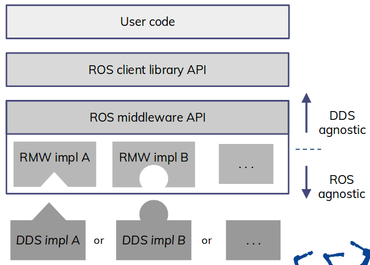

Functional requirements:

* functionality and API equivalent to ROS2 C++ client library (C++ client library has most advanced feature set right now)
  * Reference - C++ client library: [rclcpp](https://github.com/ros2/rclcpp)
* functionality equivalent to ROS2 C++ client library (C++ client library user code depends on idl generator)
  * Reference - C++ idl generator: [rosidl_generator_cpp](https://github.com/ros2/rosidl/tree/master/rosidl_generator_cpp)

Non-functional requirements:

* integration of tool based static code analysis into build tool (other client libraries aim at integration of tools extensively)
  * C++ client library reference: integration of CppCheck (common code flaw checking) into Ament (non-/CMake based) built environment for C++ client library [ament_cppcheck](https://github.com/ament/ament_lint/tree/master/ament_cppcheck) / [ament_cmake_cppcheck](https://github.com/ament/ament_lint/tree/master/ament_cmake_cppcheck)
  * C++ client library reference: integration of CppLint and clang format (style guide checking) into Ament (non-/CMake based) build environment for C++ client library [ament_cpplint](https://github.com/ament/ament_lint/tree/master/ament_cpplint) / [ament_cmake_cpplint](https://github.com/ament/ament_lint/tree/master/ament_cmake_cpplint) / [ament_clang_format](https://github.com/ament/ament_lint/tree/master/ament_clang_format)
* design by contract (C++ does not support this but will probably support it if ROS2 begins to support C++17)
* unit tests (other client libraries aim at extensive unit testing as well)
  * C++ client library reference: [rclcpp/test](https://github.com/ros2/rclcpp/tree/master/rclcpp/test)
* rmw (ROS2 middleware) integration tests (C++ client library aims at extensive middleware integration testing as well)
  * C++ client library reference: [system_tests/test_communication](https://github.com/ros2/system_tests/tree/master/test_communication)
  * test of communiaction (publish/subscribe/request/response)
  * test with all primitive and builtin types
  * test with every available rmw implementation
* security tests (C++ client library aims at extensive security testing):
  * C++ client library reference: [system_tests/test_security](https://github.com/ros2/system_tests/tree/master/test_security))
  * test nodes, publishers and subscribers with DDS-Security
* API tests (other client libraries like C++ client library aims at extensive API testing as well)
  * [C++ client library API tests](https://github.com/ros2/system_tests/tree/master/test_rclcpp)
  * Reference - ROS2 launch (test runner): [launch](https://github.com/ros2/launch/tree/master/launch)
  * Reference - Helper scripts for tests using the launch tool: [launch_testing](https://github.com/ros2/launch/tree/master/launch_testing)
* code coverage (usually web services like [coveralls.io](https://coveralls.io/) which support statement coverage analysis are used to analyze open source ROS2 packages)
  * coverage type: statement coverage
  * web service based coverage analysis for D could be executed with [coveralls.io via doveralls](https://coveralls.zendesk.com/hc/en-us/articles/204189715)
* priorization of software quality attributes (over the mid to long term I expect the following priorization for C/C++ ROS2 packages)
  * security
  * reliability
  * performance

# ROS2 Architecture

How a client library (here: C++) fits into the big picture.

* A ROS2 client library (`{client libraries}`) interfaces the [rcl](https://github.com/ros2/rcl). The `rcl` is the interface and implementation of client library functionality which is common for all client libraries. It is implemented in C. The [rmw](https://github.com/ros2/rmw) is implemented in C as well.
* For every language specific client library a generator for lanuage specific ROS2 interface is required, e.g. [rosidl_generator_cpp](https://github.com/ros2/rosidl/tree/master/rosidl_generator_cpp) generates the ROS2 interfaces in C++ (not shown in the diagram).
* In the example below the `{DDS vendor}` ([Fast-RTPS](https://github.com/eProsima/Fast-RTPS)) and `{rmw impl}` ([rmw_fastrtps_cpp](https://github.com/ros2/rmw_fastrtps)) are both implemented in C++. However these layers are independent of the client library and there is no need to implement them in D.

[ROS-I Consortium 2017 Presentation: Looking forward to ROS2](https://static1.squarespace.com/static/51df34b1e4b08840dcfd2841/t/598be660f9a61ea2b0da7bac/1502340717919/4_ROS-I+AP+Consortium+Presentation+ROS2+Tully.pdf)
